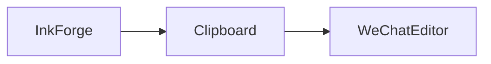

# SVG 旗舰排版真机验证样稿

> 这是一篇仓库自有、确定性、非私密的校准文稿，只陈述 InkForge 当前验收链路。

正文连续阅读流用于检查移动端行宽、段间节奏与普通 Windows 粘贴后的可读性。

本文包含 **加粗**、*斜体*、~~删除线~~、`inlineCode()`、[公开仓库链接](https://github.com/ZRainbow1275/InkForge)、<u>下划线</u>、==高亮==、H<sub>2</sub>O 与 x<sup>2</sup>。

## 二级标题：结构与重点

正文继续保持连续流，不把每个普通段落强制变成卡片。所有数字只描述本次校准：16 套预设、1 个当前 release、1 条普通粘贴链路。

### 三级标题：列表与路径

- 无序条目：核对首屏
  - 嵌套条目：核对中段
- 无序条目：核对文末

1. 有序条目：软件真实复制
2. 有序条目：微信正文普通粘贴

- [x] 当前 release 已绑定
- [ ] 平台原生媒体仍需人工确认

#### 四级标题：表格与代码

| 验收项 | 当前方法 |
| --- | --- |
| 富文本 | 软件真实复制 |
| 编辑器 | 普通 Ctrl+V |

```ts
const ordinaryPaste = true
const syntheticClipboardEvent = false
```

##### 五级标题：公式与流程

行内公式 $E = mc^2$。

$$
a^2 + b^2 = c^2
$$



###### 六级标题：图片、题注与来源


*图注：公开项目图形用于真实图片通道验收。*

> “真实复制、普通粘贴、同一正文读回。” —— InkForge 当前验收协议

---

组件目录以下由当前 `listWritingComponentDefinitions()` 动态枚举生成；缺失、未知或无效组件会使生成失败。

<MpProfile version="1" displayName="InkForge" accountId="ZRainbow1275/InkForge" description="仓库自有、确定性、非私密的当前 release 校准内容。" profileUrl="https://github.com/ZRainbow1275/InkForge" avatarUrl="https://github.githubassets.com/images/modules/logos_page/GitHub-Mark.png" qrImageUrl="https://api.qrserver.com/v1/create-qr-code/?size=200x200&amp;data=https%3A%2F%2Fgithub.com%2FZRainbow1275%2FInkForge" />

<AuthorBlock version="1" name="InkForge" role="仓库自有校准文稿" bio="仓库自有、确定性、非私密的当前 release 校准内容。" />

<QRCodeBlock version="1" url="https://github.com/ZRainbow1275/InkForge" imageUrl="https://api.qrserver.com/v1/create-qr-code/?size=200x200&amp;data=https%3A%2F%2Fgithub.com%2FZRainbow1275%2FInkForge" label="验收覆盖率" />

<TipBlock version="1" title="提示框验收" content="该组件由软件真实 registry 解析并进入同一微信导出管线。" />

<InfoGrid version="1" title="信息网格验收" items="验收对象|当前 release&#10;操作|普通 Ctrl+V" />

<TableBlock version="1" title="表格验收" columns="验收项|状态|证据" rows="普通粘贴|执行中|可信事件" />

<TimelineBlock version="1" title="时间线验收" items="开始|软件真实复制|当前轮&#10;完成|微信正文读回|当前轮" />

<CompareBlock version="1" title="对比卡验收" leftTitle="保留语义" leftItems="标题层级&#10;正文节奏&#10;组件来源" rightTitle="平台降级" rightItems="脚本清除&#10;宽度约束&#10;原生媒体待确认" />

<StatBlock version="1" label="验收覆盖率" value="100%" description="仓库自有、确定性、非私密的当前 release 校准内容。" source="InkForge 本轮验收" />

<GalleryBlock version="1" title="图集验收" images="https://github.githubassets.com/images/modules/logos_page/GitHub-Mark.png|InkForge 公开项目图形|真实图片通道验收" />

<CitationBlock version="1" quote="所有结论仅绑定当前 release、当前普通粘贴事件与当前正文读回。" author="InkForge" source="InkForge 本轮验收" sourceUrl="https://github.com/ZRainbow1275/InkForge" />

<SongBlock version="1" title="Auld Lang Syne" artist="Frank C. Stanley" url="https://commons.wikimedia.org/wiki/File:Auld_Lang_Syne.ogg" />

<ImageBlock version="1" url="https://github.githubassets.com/images/modules/logos_page/GitHub-Mark.png" alt="InkForge 公开项目图形" caption="公开项目图形用于图片与题注链路验收" />

<LinkBlock version="1" title="链接卡片验收" description="仓库自有、确定性、非私密的当前 release 校准内容。" url="https://github.com/ZRainbow1275/InkForge" />

<ArticleBlock version="1" title="关联文章验收" summary="仓库自有、确定性、非私密的当前 release 校准内容。" url="https://github.com/ZRainbow1275/InkForge" />

<ContactCard version="1" displayName="InkForge" accountId="ZRainbow1275/InkForge" profileUrl="https://github.com/ZRainbow1275/InkForge" />

<WechatMediaBlock version="1" kind="文章" title="微信原生媒体描述验收" url="https://github.com/ZRainbow1275/InkForge" />

参考资料：InkForge 公开仓库与本次当前 release 的结构化读回。[^inkforge]

文末校准哨兵：真实渲染、真实跑通、零模拟。

[^inkforge]: [https://github.com/ZRainbow1275/InkForge](https://github.com/ZRainbow1275/InkForge)