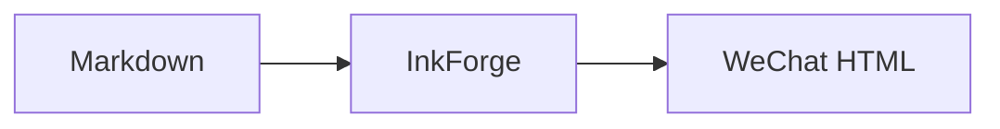

# InkForge 微信保真语料

INKFORGE_WECHAT_FIDELITY_SENTINEL_20260821

[toc depth=3 numbered=true]

## 二级标题 Heading Two

中文段落用于检查标点、换行与移动端节奏。Latin text verifies mixed-script spacing, an [external link](https://example.com/inkforge), **strong**, *emphasis*, ~~deletion~~, `inline code`, ==highlight==, :sparkles:, [[微信排版|内部链接]] 与引用 [@lamport1978]。

### 三级标题

> 引用块保留来源语义、段落边界与中文引号“测试”。
>
> 第二段包含 $E = mc^2$ 行内公式。

1. 有序一级
   - 无序二级
     1. 有序三级
     2. 第二项
   - [x] 已完成任务
   - [ ] 未完成任务
2. 有序一级第二项

#### 四级标题

| 指标 | 中文 | Latin | 数值 | 行内公式 | 长链接 | 状态 | 备注 |
| --- | --- | --- | ---: | --- | --- | --- | --- |
| A | 表格单元格 | wide-column | 12345 | $a^2+b^2=c^2$ | https://example.com/a/very/long/path?source=inkforge&mode=wechat | ready | 宽表格保真 |
| B | 第二行 | mixed-script | 67890 | $\sum_{i=1}^{n}i$ | https://example.com/another/long/path | pending | 公式在表格内 |

##### 五级标题

```ts
const target = 'wechat-fidelity-corpus'
console.log(target)
```

```
untagged code fence
  keeps indentation
```

行内公式：$\alpha + \beta = \gamma$。

$$
\int_{0}^{\infty} e^{-x^2}\,dx = \frac{\sqrt{\pi}}{2}
$$

$$
\left(\sum_{k=1}^{n} k^3\right)^2
= \left(\frac{n^2(n+1)^2}{4}\right)^2
+ \frac{\prod_{j=1}^{6}(n+j)}{7!}
$$



###### 六级标题

:::details 展开后的写作组件
详情正文包含 ==color:yellow 高亮==、[[保真语料#二级标题]] 与 :memo:。
:::

正文脚注标记[^fidelity]，并保留一个独立引用 {cite: inkforge-wechat}.

<!-- source-owned-image-sha256: 431ced6916a2a21a156e38701afe55bbd7f88969fbbfc56d7fe099d47f265460; cover-intent: true -->
<figure data-inkforge-role="source-owned-cover"><figcaption>源自仓库的确定性图片；作为正文图片与候选封面。</figcaption></figure>

[^fidelity]: 脚注正文用于验证微信脚注列表。
