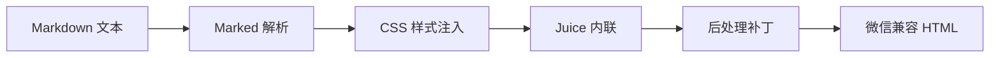

# 微信公众号渲染规则指南

> **版本**：v4.0 (多平台收口与微信官方规范补充版)
> **日期**：2026-06-09
> **来源**：doocs/md 项目深度分析 + lyricat/wechat-format 参考 + 微信公众平台编辑器插件开发规范 + InkForge `prompts/0601/` 真实微信粘贴证据

> 本文件是历史指南的延续。当前可执行合同以 `docs/platform-rendering-rules/wechat-rules.md`、`docs/platform-rendering-rules/market-practices-catalog.md` 和 `.trellis/spec/frontend/wechat-svg-modules.md` 为准。若旧段落写法与三者冲突，以新合同为准。
> 用户可选样式的运行时合同以 `inkforge/src/services/export/style-catalog.ts` 为准；文档矩阵只能扩展规则语义，不能越过 runtime catalog 的 evidence/status gate。

## 零、2026-06 收口结论

- 微信公众号输出必须是 `inline-style HTML`，可选包含通过 `checkWechatSafe` 的 inline SVG。
- SVG 不是“全部不支持”；InkForge 已实测 WeChat-safe SVG 子集和 HTML 色块层可在真实微信编辑器粘贴后存活。
- SVG 也不是“任意支持”；禁用 id/class 依赖、`<style>`、`<defs>`、gradient、clip/mask/filter、`<use>`、`url(#...)`、外部 `<image href>`、事件处理器。
- 文本优先使用 inline HTML block，SVG 主要承担图形装饰、分隔、印章、几何图标和少量 opt-in 互动。
- 微信官方编辑器规范要求规避固定宽高、`line-height:0`、透明图片叠 SVG、普通文本放 `<pre>`、`text-align:start/end`、深色模式不可读、SVG `begin` 仅 `touchstart` 等问题。
- InkForge UI 图标不得使用 emoji；alert/callout/guide 图标使用 `lucide-vue-next` 或 inline SVG path。
- 135/秀米的 2026-06-08 登录态实机学习只作为 taxonomy 和 workflow 输入：样式中心、模板中心、SVG 效果、导入/插件/同步、动作/图层/自由布局等能力必须转译为 InkForge 自有规则，不复制模板，不复用会员素材，不把插件传输或本地预览当成微信发布成功。
- 2026-06-08 二次实机复核确认：135 SVG 中心多类效果标注“仅支持手机端触发”；这类效果只能作为 `mobile-only-risk` 候选。PC 后台粘贴成功、本地 Tauri/WebView2 e2e 或桌面编辑器 DOM 保留都不能替代手机微信扫码预览中的触发、暗黑模式和封面缩略图证据。
- 2026-06-08 `flagship-amber` 真实微信普通剪贴板重试确认：artifact 剪贴板中含富 HTML/SVG，但 `Control+V` 后编辑器 DOM 读回为纯文本（`data-ink-svg=0`、`svg=0`、`style=0`）。因此 amber 在普通剪贴板渠道保持 `blocked`，不能把本地/Tauri/export artifact 外推为 PC 富文本粘贴通过。
- 2026-06-09 CloakBrowser `inkforge-0601` 只读复核确认：真实微信 PC 图文编辑器可达，标题/正文 `.ProseMirror` DOM 可读，正文编辑区视觉存在；但当前草稿正文含真实音频卡，本轮未执行粘贴、保存、预览或发布。该证据只对应 `authenticated-editor-reachable` / `pc-editor-dom-readable`，不能升级 `pc-editor-paste`、`mobile-preview`、`credentialed-sync` 或 `published`。
- 任何声称微信正文可依赖 `<script>`、`onclick`、DOM listener、class selector、`<style>`、外部 CSS 或外部资源驱动 SVG 交互的资料，都按冲突资料处理；在 InkForge 合同中这些是禁止项或高风险项，不是能力承诺。

---

## 一、核心约束

### 1.1 微信编辑器限制

| 限制项 | 说明 | 影响 |
|--------|------|------|
| ❌ `<style>` 标签 | 会被完全剥离 | 必须 CSS 内联 |
| ❌ `<link>` 标签 | 外部 CSS 不支持 | 必须 CSS 内联 |
| ❌ CSS 变量 | `var(--color)` 不解析 | 必须后处理替换 |
| ❌ 复杂选择器 | 内联后失效 | 使用简单选择器 |
| ❌ 外链图片 | 需转存到微信服务器 | 需用户手动处理 |
| ⚠️ SVG | WeChat-safe 子集支持，复杂交互需实测 | 需安全子集、Dark Mode 与 fallback 处理 |
| ❌ 脚本 | 完全不支持 | 静态 HTML only |

### 1.2 解决方案

**核心思路**：将所有样式预计算并写入 HTML 元素的 `style` 属性（CSS 内联）。

---

## 二、四层转换管线



### 2.1 层级职责

| 层级 | 职责 | 工具/库 | 代码位置 |
|------|------|---------|----------|
| **XSS 防护** | HTML 消毒清理 | `DOMPurify` | `export/wechat.ts` |
| **Task List 转换** | Checkbox → Unicode 符号 | 自定义正则 | `export/utils.ts` |
| **空段落清理** | 移除空 `<p>` 和连续 `<br>` | 自定义正则 | `export/utils.ts` |
| **代码高亮** | 语法着色 + 行号 + Mac代码块 | `highlight.js` + 自定义 | `export/utils.ts` |
| **Alert 块渲染** | `[!NOTE]` 等 GitHub 风格提示块 | 自定义正则/DOM | `export/utils.ts` |
| **外链转脚注** | 非微信链接转底部引用 | DOM 操作 | `export/wechat.ts` |
| **CSS 样式注入** | 注入主题 `<style>` 标签 | `generateThemeCSS()` | `export/themes.ts` |
| **Juice 内联** | `<style>` → inline style | `juice` | `export/wechat.ts` |
| **表格增强** | 条纹行、圆角、主色表头 | DOM 操作 | `export/utils.ts` |
| **后处理补丁** | 微信兼容性修复（blockquote/figcaption/SVG/嵌套列表） | 正则/DOM | `export/wechat.ts` |

---

## 三、转换规则详解

### 3.1 规则一：CSS 必须可被 Juice 内联

**原理**：[juice](https://github.com/Automattic/juice) 库将 CSS 规则解析后写入对应 HTML 元素的 `style` 属性。

**使用方式**：
```typescript
import juice from 'juice'

const inlinedHtml = juice(html, {
    inlinePseudoElements: true,
    preserveImportant: true,
    resolveCSSVariables: false  // 禁用 juice 的变量解析，后续手动处理
})
```

**编写规范**：

| ✅ 支持 | ❌ 不支持 |
|---------|----------|
| `h1 { color: red; }` | `:hover`, `:focus` 伪类 |
| `.class { margin: 10px; }` | `@media` 媒体查询 |
| `#id { padding: 5px; }` | `::before`, `::after` 伪元素（部分） |
| `table td { border: 1px; }` | CSS 变量（需后处理） |

---

### 3.2 规则二：CSS 变量必须后处理替换

**原理**：微信不支持 `var(--color)`，需在 juice 处理后用正则替换为具体值。

**实现**：
```typescript
// 替换 CSS 变量
html = html
    .replace(/hsl\(var\(--foreground\)\)/g, '#3f3f3f')
    .replace(/var\(--blockquote-background\)/g, '#f7f7f7')
    .replace(/var\(--md-primary-color\)/g, primaryColor)
    .replace(/--md-primary-color:.+?;/g, '')
    .replace(/--md-font-family:.+?;/g, '')
    .replace(/--md-font-size:.+?;/g, '')
```

**预定义变量**：

| 变量名 | 用途 | 替换值示例 |
|--------|------|-----------|
| `--md-primary-color` | 主题色 | `#0F4C81` |
| `--md-font-family` | 字体 | 具体字体栈 |
| `--md-font-size` | 基准字号 | `16px` |
| `--foreground` | 前景文字色 | `#3f3f3f` |
| `--blockquote-background` | 引用块背景 | `#f7f7f7` |

---

### 3.3 规则三：图片属性转换为内联样式

**原理**：微信对 `` 的解析不一致，需转为 `style="width: 100px;"`。

**实现**：
```typescript
function normalizeImageAttributes(html: string): string {
    const div = document.createElement('div')
    div.innerHTML = html
    
    const images = div.getElementsByTagName('img')
    Array.from(images).forEach((img) => {
        const width = img.getAttribute('width')
        const height = img.getAttribute('height')
        
        if (width) {
            img.removeAttribute('width')
            img.style.width = /^\d+$/.test(width) ? `${width}px` : width
        }
        if (height) {
            img.removeAttribute('height')
            img.style.height = /^\d+$/.test(height) ? `${height}px` : height
        }
    })
    
    return div.innerHTML
}
```

---

### 3.4 规则四：HTML 结构调整

**问题**：微信对嵌套列表渲染异常。

**修复**：将 `<li><ul>...</ul></li>` 调整为 `<li>...</li><ul>...</ul>`

**实现**：
```typescript
function modifyHtmlStructure(html: string): string {
    const div = document.createElement('div')
    div.innerHTML = html
    
    // 移动 li > ul 和 li > ol 到 li 后面
    div.querySelectorAll('li > ul, li > ol').forEach((list) => {
        list.parentElement!.insertAdjacentElement('afterend', list)
    })
    
    return div.innerHTML
}
```

---

### 3.5 规则五：SVG 和 Mermaid 特殊处理

**问题**：
1. SVG 复制到微信时边界丢失
2. Mermaid 生成的 SVG 结构不兼容

**解决方案**：

```typescript
// 1. 添加空白节点用于兼容 SVG 复制
function addSvgBoundaries(html: string): string {
    const div = document.createElement('div')
    div.innerHTML = html
    
    const beforeNode = createEmptyParagraph()
    const afterNode = createEmptyParagraph()
    div.insertBefore(beforeNode, div.firstChild)
    div.appendChild(afterNode)
    
    return div.innerHTML
}

function createEmptyParagraph(): HTMLElement {
    const p = document.createElement('p')
    p.innerHTML = '&nbsp;'
    p.style.margin = '0'
    p.style.padding = '0'
    return p
}

// 2. 历史方案：修复 Mermaid 文本颜色
// 当前最终合同不再依赖 raw Mermaid SVG 或 !important；
// 图表应优先走 WeChat-safe SVG/PNG fallback，并经过最终输出检测。
html = html.replace(
    /<tspan([^>]*)>/g,
    '<tspan$1 style="fill:#333333;stroke:none;">'
)
```

---

### 3.6 规则六：特殊 CSS 属性转换（历史废弃）

**历史问题**：微信对 `top` 等定位属性支持差。

**当前规则**：不要把 HTML `style` 内的 `top/left/right/bottom` 自动改成 `transform: translate(...)`。当前 WeChat-safe 合同禁止最终 HTML 依赖 style-transform；仅允许 SVG 内部使用 XML `transform` 属性。需要微调布局时，使用 DOM 顺序、`margin`、`display:table/table-cell`、真实 inline block，或降级为 raster/long-image artifact。

```typescript
// 禁止：把定位属性转换成 HTML style-transform。
// html = html.replace(/([^-])top:(.*?)em/g, '$1transform: translateY($2em)')
```

---

## 四、CSS 编写规范

### 4.1 排版规范

| 属性 | 规范值 | 说明 |
|------|--------|------|
| 字体大小 | 14-16px | 每行约25-28字 |
| 行高 | 1.75-2.0 | 充足的呼吸感 |
| 字间距 | 0.03-0.05em | 阅读舒适度 |
| 段落间距 | 1.5em | 段落间留白 |
| 首行缩进 | 2em（可选） | 中文排版传统 |

当前 InkForge 读屏节奏合同：

- 历史表格保留作旧实现参考，不再作为旗舰预设的唯一口径。
- 当前微信/旗舰输出默认以 16-17px 正文字号、约 1.7-1.9 行高、20-22 CJK 字/行作为移动端阅读目标。
- `#nice` / 微信正文外层应保持响应式宽度和 375px 手机预览可读节奏；不得为了桌面编辑器展示而固定正文容器宽高。
- 若用户选择更强视觉样式，标题、卡片、封面可以增强，但正文阅读节奏不得被压缩为过密小字或不可重排 SVG 文本。

### 4.2 字体栈推荐

```css
font-family: -apple-system-font, BlinkMacSystemFont, 
    "Helvetica Neue", "PingFang SC", 
    "Hiragino Sans GB", "Microsoft YaHei UI", 
    "Microsoft YaHei", Arial, sans-serif;
```

### 4.3 安全样式清单

| 元素 | 安全属性 |
|------|---------|
| **容器** | `padding`, `margin`, `background`, `color` |
| **文字** | `font-size`, `font-weight`, `line-height`, `text-align` |
| **边框** | `border`, `border-radius` |
| **布局** | `display: block/inline-block/table/table-cell`, `max-width`, responsive `width`, media-normalized `height:auto`, `float` |
| **表格** | `border-collapse`, `text-align` |

### 4.4 高风险样式

| 属性 | 风险 | 替代方案 |
|------|------|---------|
| `position: absolute/fixed` | 不可靠 | `float: right` 或 `margin` 负值 |
| `top/left/right/bottom` | 部分失效；自动转 HTML style-transform 已废弃 | DOM 顺序、`margin`、`display:table/table-cell`；仅 SVG 内可用 XML `transform` |
| `display: flex/grid` | **会被后处理移除** | `display: table` + `table-cell` |
| `flex-direction/align-items` | **会被后处理移除** | `vertical-align` + `display:block` |
| `background-image` | 外链不加载 | 使用 `` |
| `::before/::after` | 内联后丢失 | 使用真实 HTML 元素 |
| fixed content `width/height` | 破坏响应式或导致移动端空白 | 可读容器使用 `max-width:100%`、自然高度和文档流 |
| `line-height:0` 包可读文本 | 文字重叠或不可见 | 只对纯图形空节点谨慎使用；正文容器必须有可读行高 |
| `opacity:0` 图片叠 SVG | 发布后真实图片不可编辑 | 使用真实 ``、微信素材图或可编辑图框，不隐藏图片 |
| `begin="touchstart"` | PC 无法触发 SVG 动画 | 用 `click` 候选并保留手机预览证据；未证实则降级 |

> **重要**：`postProcessForWechat` 会主动移除 `display:flex`、`flex-direction`、`flex-wrap`、`justify-content`、`align-items`、`flex` 等属性。代码块布局必须使用 `table-cell` 替代。

---

## 五、代码高亮处理

### 5.1 多主题代码高亮系统

InkForge 支持 **7 种代码高亮主题**，全部通过 inline style 输出，完全兼容微信渲染环境。

| 主题 ID | 名称 | 背景色 | 风格 |
|---------|------|--------|------|
| `atom-one-dark` | Atom 暗色（默认） | `#282c34` | 深色经典 |
| `atom-one-light` | Atom 亮色 | `#fafafa` | 浅色简洁 |
| `github-dark` | GitHub 暗色 | `#24292e` | GitHub 风 |
| `github-light` | GitHub 亮色 | `#f6f8fa` | GitHub 风 |
| `monokai` | Monokai | `#272822` | 高对比度 |
| `vs2015` | VS 2015 | `#1e1e1e` | 微软风 |
| `dracula` | Dracula | `#282a36` | 紫色调 |

### 5.2 高亮流程

```typescript
import hljs from 'highlight.js'

function highlightCodeBlocks(
    html: string,
    enableLineNumbers?: boolean,
    enableMacCodeBlock?: boolean,
    themeId?: CodeTheme,        // 新增：指定主题
    enableLanguageLabel?: boolean // 新增：语言标签
): string {
    const div = document.createElement('div')
    div.innerHTML = html

    div.querySelectorAll('pre code').forEach((block) => {
        hljs.highlightElement(block as HTMLElement)
    })

    // 将 hljs class 转为 inline style（基于选定主题）
    let result = convertHljsClassesToInlineStyles(div.innerHTML, themeId)

    // 可选：添加行号
    if (enableLineNumbers) {
        result = addLineNumbers(result, themeId)
    }

    // 可选：Mac 风格代码块头部（三色圆点 + 语言标签）
    if (enableMacCodeBlock) {
        result = wrapWithMacHeader(result, language, themeId)
    }

    return result
}
```

### 5.3 主题色彩映射 (CODE_THEME_REGISTRY)

每个主题定义完整的 12 色映射表：

```typescript
interface CodeThemeColors {
    background: string    // 背景色
    foreground: string    // 前景色（默认文本）
    comment: string       // 注释色
    keyword: string       // 关键字色
    string: string        // 字符串色
    number: string        // 数字/常量色
    function: string      // 函数名色
    type: string          // 类型/类名色
    variable: string      // 变量/属性色
    tag: string           // HTML标签色
    attribute: string     // 属性名色
    operator: string      // 操作符色
    lineNumber: string    // 行号色
    lineNumberBorder: string // 行号边框色
    macHeaderBg: string   // Mac 头部背景色
}
```

### 5.4 Mac 风格代码块

```html
<!-- Mac 代码块结构（微信兼容版：使用 overflow:hidden + float:right 替代 flex） -->
<section style="border-radius: 8px; overflow: hidden; margin: 1.5em 0;">
    <!-- 头部：三色圆点 + 语言标签（非 flex 布局） -->
    <section style="padding: 8px 12px; background: #21252b; border-radius: 8px 8px 0 0; overflow: hidden;">
        <span style="display: inline-block; width: 12px; height: 12px; border-radius: 50%; background: #ff5f56; margin-right: 6px;"></span>
        <span style="display: inline-block; width: 12px; height: 12px; border-radius: 50%; background: #ffbd2e; margin-right: 6px;"></span>
        <span style="display: inline-block; width: 12px; height: 12px; border-radius: 50%; background: #27c93f; margin-right: 6px;"></span>
        <span style="float: right; color: #636d83; font-size: 12px; font-family: monospace; line-height: 12px;">JavaScript</span>
    </section>
    <!-- 代码区 -->
    <pre style="background: #282c34; margin: 0; padding: 16px; border-radius: 0 0 8px 8px;"><code>...</code></pre>
</section>
```

### 5.5 代码行号布局

```html
<!-- 行号布局（微信兼容版：使用 table-cell 替代 flex） -->
<pre style="background: #282c34; padding: 0; border-radius: 8px; overflow: hidden;">
  <code>
    <span style="display: table; width: 100%; table-layout: fixed;">
      <span style="display: table-cell; vertical-align: top; border-right: 1px solid #3e4451; padding: 16px 0; width: 2.6em;">
        <!-- 行号 -->
        <span style="display: block; color: #636d83; text-align: right; padding-right: 12px;">1</span>
        <span style="display: block; color: #636d83; text-align: right; padding-right: 12px;">2</span>
      </span>
      <span style="display: table-cell; vertical-align: top; padding: 16px 0 16px 12px; overflow-x: auto;">
        <!-- 代码行 -->
        <span style="display: block;">const x = 1;</span>
        <span style="display: block;">console.log(x);</span>
      </span>
    </span>
  </code>
</pre>
```

> **重要**：行号和 Mac 代码块使用 `table-cell` / `float` 布局而非 `flex`，因为微信后处理会移除所有 flex 相关属性。

---

## 五-A、GitHub Alert 块渲染

### Alert 类型

支持 5 种 GitHub 风格 Alert 块（[GFM Alert Syntax](https://docs.github.com/en/get-started/writing-on-github/getting-started-with-writing-and-formatting-on-github/basic-writing-and-formatting-syntax#alerts)）：

| 类型 | Markdown 语法 | 图标 | 主色 | 背景色 |
|------|--------------|------|------|--------|
| NOTE | `> [!NOTE]` | inline SVG info path | `#0969da` | `#ddf4ff` |
| TIP | `> [!TIP]` | inline SVG check path | `#1a7f37` | `#dafbe1` |
| IMPORTANT | `> [!IMPORTANT]` | inline SVG mark path | `#8250df` | `#fbefff` |
| WARNING | `> [!WARNING]` | inline SVG warning path | `#9a6700` | `#fff8c5` |
| CAUTION | `> [!CAUTION]` | inline SVG stop path | `#d1242f` | `#ffebe9` |

### 渲染输出

```html
<section style="border-left: 4px solid #0969da; background: #ddf4ff; padding: 12px 16px; margin: 16px 0; border-radius: 4px;">
    <div style="font-weight: 700; color: #0969da; margin-bottom: 4px;">
        <span style="display:inline-block;width:14px;height:14px;margin-right:6px;vertical-align:-2px;"><svg viewBox="0 0 16 16" width="14" height="14" aria-hidden="true"><circle cx="8" cy="8" r="7" fill="#0969da"></circle><path d="M7.2 7h1.6v5H7.2zM7.2 4h1.6v1.6H7.2z" fill="#ffffff"></path></svg></span>Note
    </div>
    <div style="color: #24292f;">Alert 内容文本...</div>
</section>
```

---

## 五-B、表格增强样式

### 增强特性

| 特性 | 说明 |
|------|------|
| **主色表头** | `<thead>` 使用预设主色背景 + 白色文字 |
| **条纹行** | 偶数行 `background: #f9fafb`，每个表格独立计数 |
| **圆角容器** | 外层 `<section>` 8px 圆角 + 阴影 |
| **溢出滚动** | `overflow-x: auto` 防止宽表格撑爆布局 |

### 渲染输出

```html
<section style="border-radius: 8px; overflow: hidden; box-shadow: 0 1px 3px rgba(0,0,0,0.1); margin: 1.5em 0;">
    <div style="overflow-x: auto;">
        <table style="width: 100%; border-collapse: collapse;">
            <thead>
                <tr style="background: #004080; color: #fff;">
                    <th style="padding: 10px 14px;">列标题</th>
                </tr>
            </thead>
            <tbody>
                <tr style="background: #ffffff;">...</tr>
                <tr style="background: #f9fafb;">...</tr>  <!-- 条纹行 -->
            </tbody>
        </table>
    </div>
</section>
```

---

## 五-C、Blockquote 增强

微信导出的 blockquote 样式增强：

```css
blockquote {
    border-left: 4px solid ${primaryColor};
    background: #f5f7f9;
    padding: 12px 16px;
    margin: 16px 0;
    border-radius: 0 4px 4px 0;
    color: #555;
}
```

## 五-D、Figcaption 图片说明样式

```css
figcaption {
    text-align: center;
    font-style: italic;
    color: #999;
    font-size: 13px;
    margin-top: 8px;
}

---

## 六、外链转脚注

### 6.1 转换逻辑

外链（非 `mp.weixin.qq.com`）无法在微信中直接点击，需转为底部脚注引用。

```typescript
function convertLinksToFootnotes(html: string): {html: string, footnotes: string[]} {
    const div = document.createElement('div')
    div.innerHTML = html
    const footnotes: string[] = []
    
    div.querySelectorAll('a').forEach((link) => {
        const href = link.getAttribute('href')
        if (!href?.includes('mp.weixin.qq.com')) {
            const index = footnotes.length + 1
            footnotes.push(href!)
            
            // 替换为上标编号
            const sup = document.createElement('sup')
            sup.textContent = `[${index}]`
            sup.style.color = '#1890ff'
            link.after(sup)
        }
    })
    
    return { html: div.innerHTML, footnotes }
}
```

### 6.2 脚注格式

```html
<section style="margin-top: 32px; border-top: 1px solid #eee; padding-top: 16px;">
    <p style="font-size: 12px; color: #666;">参考链接：</p>
    <p style="font-size: 12px; color: #666;">[1] https://example.com/article</p>
    <p style="font-size: 12px; color: #666;">[2] https://github.com/repo</p>
</section>
```

---

## 七、开发检查清单

在开发或调试微信导出功能时，请确保区分 authoring/pre-juice CSS 与 final HTML：

- [ ] authoring CSS 可以使用简单选择器进入 juice；final HTML 不得依赖 class/id selector。
- [ ] final HTML 无 `<style>`、无 raw class/id 依赖、无 CSS 变量、无 `!important`、无 unsupported CSS。
- [ ] 所有 CSS 变量有对应的最终值替换规则（含 `var(--name, fallback)` 格式），并在 final HTML 阶段被清空。
- [ ] 图片的 width/height 属性转为 style
- [ ] 嵌套列表结构已调整（li > ul → 兄弟）
- [ ] SVG 前后添加了空白占位符
- [ ] 使用 DOMPurify 进行 XSS 清理（允许 figure/figcaption）
- [ ] **Task List checkbox 在 DOMPurify 之前转为 Unicode 符号（☐/☑）**
- [ ] **空段落 `<p></p>` 和连续 `<br>` 已清理**
- [ ] 代码块 class 转为 inline style（支持多主题）
- [ ] **代码块布局使用 table-cell 而非 flex**（微信后处理会移除 flex）
- [ ] **Mac 代码块头部使用 float:right 而非 flex**
- [ ] **语言标签使用 float:right 而非 position:absolute**
- [ ] 外链已转为脚注（支持嵌套 HTML 的链接文本）
- [ ] GitHub Alert 块正确渲染为内联样式
- [ ] 表格有条纹行 + 主色表头 + 圆角容器（多表格独立计数）
- [ ] blockquote 有左色条 + 浅灰背景 + 圆角
- [ ] figcaption 居中、斜体、灰色
- [ ] Mac 代码块三色圆点 + 语言标签正常显示
- [ ] 代码行号在各主题下颜色正确
- [ ] **首元素 margin-top 清零（防止微信顶部空白）**
- [ ] **三平台 DOMPurify 标签列表一致（h1-h6, del/s/ins, mark, sub/sup）**
- [ ] **三平台 CSS 元素覆盖完整（h1-h6, del/s, mark, sub/sup）**
- [ ] PC 微信公众号后台粘贴：记录当前账号已进入图文编辑器，粘贴后 DOM/局部截图证明目标 HTML/SVG 被保留。
- [ ] 手机微信扫码预览：至少覆盖正文首屏、关键 SVG/HTML block、长文中段和文末，不用 PC/Tauri 截图替代。
- [ ] 手机 Dark Mode：检查文本、HTML 色块、SVG 文本/线条、透明图和背景图对比度。
- [ ] SMIL/click 交互：记录触发前后或明确标记 `blocked` / static fallback。
- [ ] 封面缩略图/预览入口：单独记录封面设置、2.35:1 / 1:1 裁切或缺失原因；正文粘贴通过不能替代封面门禁。
- [ ] 同步草稿/插件传输/定时群发/发布：仅在真实账号、授权、接口或后台返回、平台预览齐全时标记通过；否则标记 `blocked` / `unavailable`。

---

## 八、转换管线完整代码

### 8.1 微信导出管线 (8 步)

```typescript
// services/export/wechat.ts - convertToWechat (11 步管线)
function convertToWechat(html: string, preset: ExportPreset, options: ExportOptions): string {
    // 1. Task List Checkbox 转 Unicode 符号（必须在 DOMPurify 之前）
    result = convertTaskListCheckboxes(html, preset.primaryColor)

    // 2. XSS 防护（允许 figure/figcaption，禁止 input/form）
    result = DOMPurify.sanitize(result)

    // 2.5. 空段落清理 + 连续换行限制
    result = limitConsecutiveBreaks(cleanEmptyParagraphs(result))

    // 3. 代码高亮（多主题 + Mac代码块 + 行号 + 语言标签）
    result = highlightCodeBlocks(result, options.enableLineNumbers,
        options.enableMacCodeBlock, options.codeTheme, options.enableCodeLanguageLabel)

    // 4. GitHub Alert 块渲染
    result = renderAlertBlocks(result)

    // 5. 外链转脚注
    result = convertLinksToFootnotes(result)

    // 6. 应用主题 CSS
    const styledHtml = `<style>${generateThemeCSS(preset)}</style>${result}`

    // 7. CSS 内联 (juice + inlinePseudoElements)
    result = juice(styledHtml, {
        inlinePseudoElements: true,
        preserveImportant: true
    })

    // 8. 标题装饰（伪元素替代方案）
    result = applyHeadingDecorations(result, preset)

    // 9. 表格增强（条纹行、圆角、主色表头）
    result = enhanceTableStyles(result, preset.primaryColor)

    // 10. 后处理补丁（CSS变量替换/首元素margin-top清零/blockquote/figcaption/SVG/嵌套列表）
    result = postProcessForWechat(result)

    return result
}
```

---

## 九、技术栈总结

| 库 | 版本 | 用途 |
|----|------|------|
| `marked` | ^15.0 | Markdown 解析 |
| `juice` | ^11.0 | CSS 内联 |
| `highlight.js` | ^11.11 | 代码高亮（7 种主题） |
| `dompurify` | ^3.3 | XSS 防护 |

---

*文档基于 doocs/md 项目分析，最后更新：2026-02-27*
